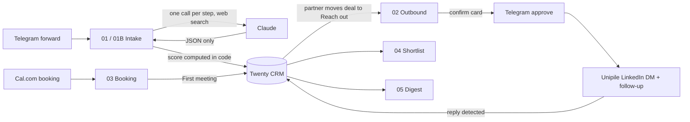

# Dealflow agent

An n8n deal-flow agent on a self-hosted Twenty CRM. A partner forwards a company
(or one message listing several) to a Telegram bot. The agent researches the
company and founders with Claude and server-side web search, checks the forward
against what it finds, scores the deal on a weighted thesis board, applies hard
out-of-scope rules and a portfolio-conflict check, and writes company, founder
and opportunity to Twenty. Outreach only starts after a human moves the deal and
approves the founder and the drafted messages.

Everything here is a template. The thesis ("Example Ventures"), portfolio,
seed companies and outreach copy are fictional. Edit them before use.

## Architecture



Claude only returns JSON. Deterministic n8n nodes hold the credentials and do
every CRM, LinkedIn and Telegram call.

## Files

```
n8n/        workflow exports, importable, inactive
config/     thesis.json and sequences.json (reference copies, see below)
crm/        Twenty docker-compose, .env.example, setup/seed/reset scripts, seed data
```

`config/` documents the thesis and outreach copy. n8n cannot read repo files,
so the runtime copies live inline in Code nodes. Edit both together:

| What | Where it runs |
|---|---|
| Thesis text, system prompt | 01 `Build Claude request`, 01B `Fan out + build requests` |
| Board weights `W`, bands | 01 `Parse + shape`, 01B `Shape B` |
| Outreach sequences | 02 `Build variant + confirm` |
| Shortlist memo format | 04 `Build Claude request` |

## Workflows

- **00 Error handler.** Error trigger that emails the workflow name, node,
  error message and execution link.
- **01 Intake.** Telegram message, one Claude call (web search, max 8 uses)
  that identifies company and founder and scores the board. Code computes the
  weighted score and band. Upserts company (by domain) and founder, creates the
  opportunity in New, or in Out of scope when a hard rule hits. Replies with a
  card.
- **01B Bulk intake.** One Claude call splits a message into n companies, then
  one research and scoring call per company (same prompt and scoring as 01),
  writes each to Twenty and sends one summary card. Research failures are listed
  and not written. Ships with its Telegram trigger disabled and a test webhook
  enabled.
- **02 Outbound.** Polls Twenty every 20 seconds for deals in Reach out. Loads
  founder and company. If there is no LinkedIn URL on the record, runs a
  Unipile people search. Picks a sequence variant from tags (referred, stealth,
  hot, otherwise active), then sends a Telegram approval card with the founder,
  LinkedIn URL and both messages. On approval: resolves the profile, saves the
  URL back to Twenty, sends message 1, moves the deal to Sequence running,
  waits, checks for a reply, sends the follow-up with the booking link, waits,
  checks again. A reply moves the deal to Replied.
- **03 Booking.** Cal.com `BOOKING_CREATED` webhook. Matches the attendee to a
  deal in Sequence running or Replied by email or name, falls back to the most
  recently updated one, moves it to First meeting and notifies Telegram.
- **04 Weekly shortlist.** Reads deals in Shortlist with their notes and has
  Claude format a memo using only facts from the notes. Sends it to Telegram and
  returns it in the HTTP response.
- **05 Pipeline digest.** Counts deals per stage and deals added in the last 7
  days. No model call.

## Setup

1. **Twenty.** In `crm/`, copy `.env.example` to `.env`, fill it, then
   `docker compose up -d`. The server joins your n8n Docker network
   (`N8N_NETWORK`) so n8n reaches it at `http://twenty-server:3000`. Open the UI,
   sign up (first user is the workspace admin), and create an API key under
   Settings > APIs & Webhooks.
2. **Run setup before anything else.** It creates the seven stages and the
   `score`, `tags`, `oneLiner`, `notes` fields the workflows write. Writes fail
   without it.
   ```
   export TWENTY_BASE_URL=http://localhost:3000 TWENTY_API_KEY=...
   python3 crm/setup_twenty.py
   python3 crm/seed_twenty.py        # optional, fictional companies
   python3 crm/reset_company.py --domain quillory.example   # remove one
   ```
3. **n8n credentials.** Create these with exactly these names so the imported
   nodes pick them up:
   - `Twenty API`: Header Auth, name `Authorization`, value `Bearer <key>`
   - `Anthropic API`: Header Auth, name `x-api-key`, value your Anthropic key
   - `Unipile API`: Header Auth, name `X-API-KEY`, value your Unipile key
   - `Telegram Bot`: Telegram API, token from BotFather
   - `SMTP`: SMTP account for error mail
4. **Import** the files in `n8n/`. Import 00 first, then set it as the Error
   workflow in the settings of each other workflow.
5. **Fill the placeholders:**
   - `YOUR_TELEGRAM_CHAT_ID`: the allowed-chat check in 01 `Build Claude
     request` and 01B `Normalize`, and the chat id in the Telegram nodes of 02,
     03, 04 and 05. To find it, message the bot and read `message.chat.id` in
     the trigger output of a test execution.
   - 02 `Config (EDIT ME)`: Unipile DSN, Unipile LinkedIn account id, booking
     link, fund name, sender name.
   - 01B `Aggregate card`: `YOUR_TWENTY_URL`.
   - 00 `Email alert`: from and to addresses.
   - `http://twenty-server:3000` in the HTTP nodes, if your container name
     differs.
   - Thesis, weights, portfolio and sequences (see the table above).
6. **Cal.com.** Add a webhook for `BOOKING_CREATED` pointing at the 03 webhook
   URL (`/webhook/dealflow-booking`).
7. **Activate** 00, then 01 or 01B, then 02 and 03. Test with forwards you
   control first, and with your own LinkedIn contact as the outreach target.

The Anthropic model and web search tool versions are set in the `requestBody`
of the Code nodes (`claude-opus-4-8`, `web_search_20260209`).

## Guardrails

- **Human gate.** Nothing is sent to a founder until a partner moves the deal to
  Reach out and approves the Telegram card showing the matched person and both
  messages. A LinkedIn search hit only ever goes to that card. No URL means the
  outreach aborts.
- **Model never holds credentials.** Claude gets the forward and the thesis and
  returns JSON. Code nodes validate it and HTTP nodes do the writes.
- **Score in code.** The model rates each variable 0-10. The weighted average,
  clamping and bands are computed in the workflow, so the model cannot inflate
  the final number.
- **Out of scope is still logged.** Hard-rule hits go to Out of scope with the
  reason and board in the notes, so passes stay searchable. A portfolio overlap
  is flagged for review, never auto-excluded.
- **Untrusted input.** Forwards are wrapped in `<forward>` tags and the prompt
  treats them as data. Intake only processes messages from the allowed chat id.
- **Reply detection window.** A reply counts only if it is an incoming message
  newer than the window (10 minutes in the `Replied?` nodes). Old messages in
  an existing chat do not stop or trigger anything.

## Known limits

- **Reply detection is poll-based.** Replies are checked only after each Wait
  node, not in real time. The Waits ship at 2 minutes for testing. For real use
  set them to days and widen the reply window to match, or a reply before the
  check will be missed.
- **Bulk results land together.** n8n finishes all items in a node before the
  next node runs, so 01B researches every company before any is written, and
  the summary card arrives at the end.
- **LinkedIn account risk is on the operator.** Unipile sends through the
  connected LinkedIn session. Keep volumes low and messages personal. Only 1st-
  degree connections get a classic DM.
- **Outbound dedupe uses workflow static data.** A deal id is processed once. To
  retry after a skip, delete the opportunity (`reset_company.py`) or clear the
  static data. Static data persists only for active, triggered executions.
- **One Telegram trigger per bot.** Telegram allows one webhook per bot, so
  activate 01 or 01B, not both. 01B also handles single-company messages.
- **List reads are one page.** 02 to 05 read up to 60 opportunities per call.
  Add paging for larger pipelines.
- **Booking match is fuzzy.** Without an email or name match, the most recently
  updated active deal gets the meeting. Check the notification.
- **Founder email is synthetic.** `first@domain` is only an idempotency key for
  the people upsert, not a real address.
